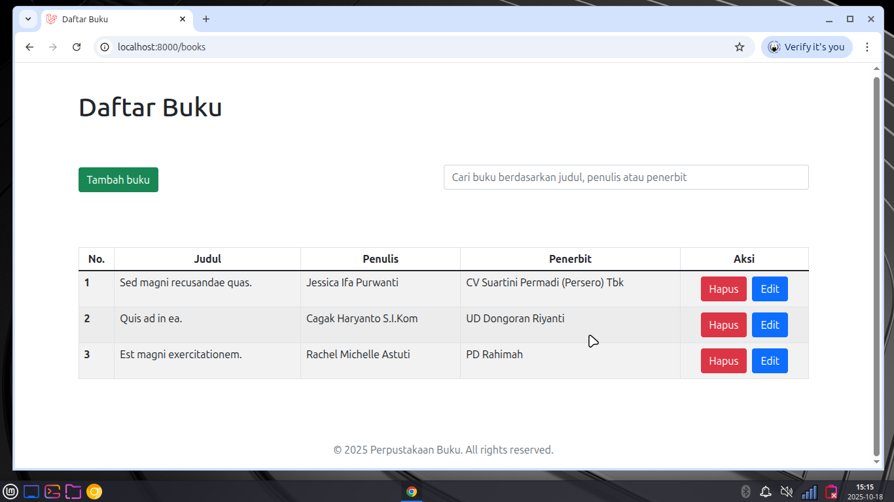
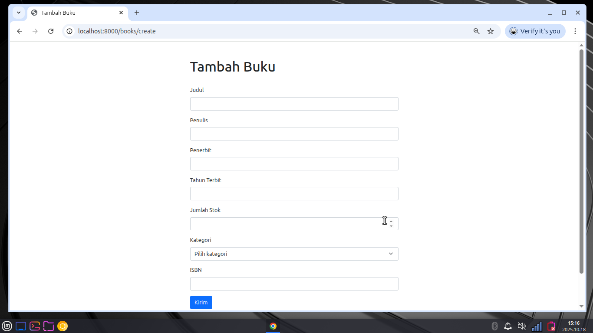
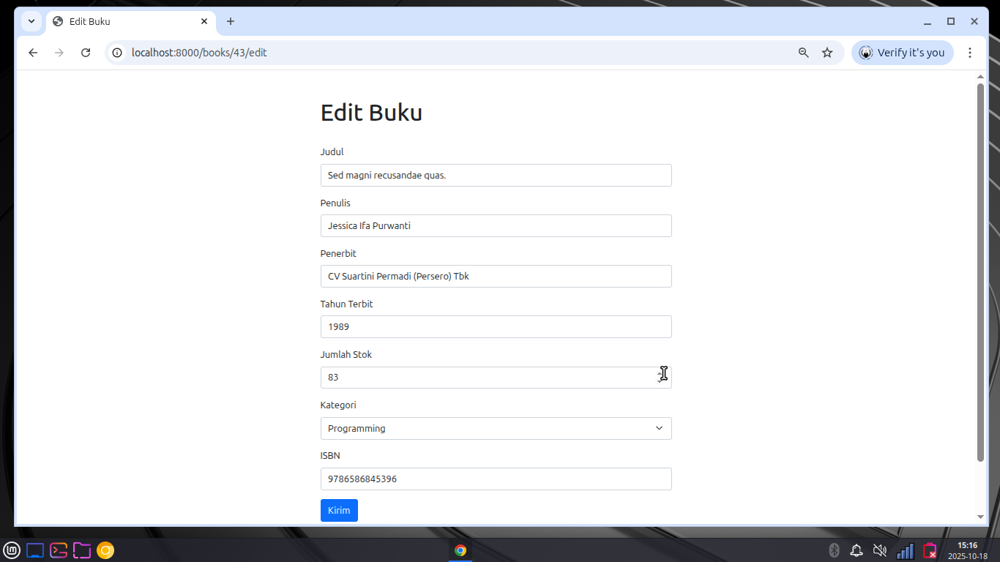

# Project Perpustakaan
Proyek ini adalah aplikasi sederhana untuk mengelola data buku di perpustakaan. Aplikasi
ini memungkinkan pengguna untuk menambahkan, menghapus, dan melihat daftar buku yang tersedia di perpustakaan.

## Fitur
- Menambahkan buku baru dengan judul, penulis, isbn, penerbit, dan tahun terbit.
- Mengedit informasi buku yang sudah ada.
- Menghapus buku dari daftar.
- Melihat daftar semua buku yang tersedia di perpustakaan.
- Mencari buku berdasarkan judul atau penulis.

## Teknologi yang Digunakan
- [Laravel 11.0](https://laravel.com)
- [PHP 8.2](https://www.php.net)
- [MariaDB](https://mariadb.org)
- [bootstrap 5](https://getbootstrap.com)

## Instalasi
1. Clone repository ini ke dalam direktori lokal Anda.
    ```bash
    git clone
    ```
2. Masuk ke direktori proyek.
    ```bash
    cd nama-direktori
    ```
3. Install dependensi menggunakan Composer.
    ```bash
    composer install
    ```
4. Salin file `.env.example` menjadi `.env` dan sesuaikan konfigurasi
    database sesuai dengan lingkungan Anda.
    ```bash
    cp .env.example .env
    ```
5. Generate aplikasi key.
    ```bash
    php artisan key:generate
    ```
6. Jalankan migrasi untuk membuat tabel di database.
    ```bash
    php artisan migrate
    ```
7. Jalankan seed untuk membuat data dummy
    ```bash
    php artisan db:seed
    ```
8. Jalankan server pengembangan.
    ```bash
    php artisan serve
    ```
9. Akses aplikasi melalui browser di `http://localhost:8000/books`.

## Galeri 
 
<br>

<br>


## Social Media
- [GitHub](https://github.com/haichannn/)
- [Instagram](https://instagram.com/_haichannn)

